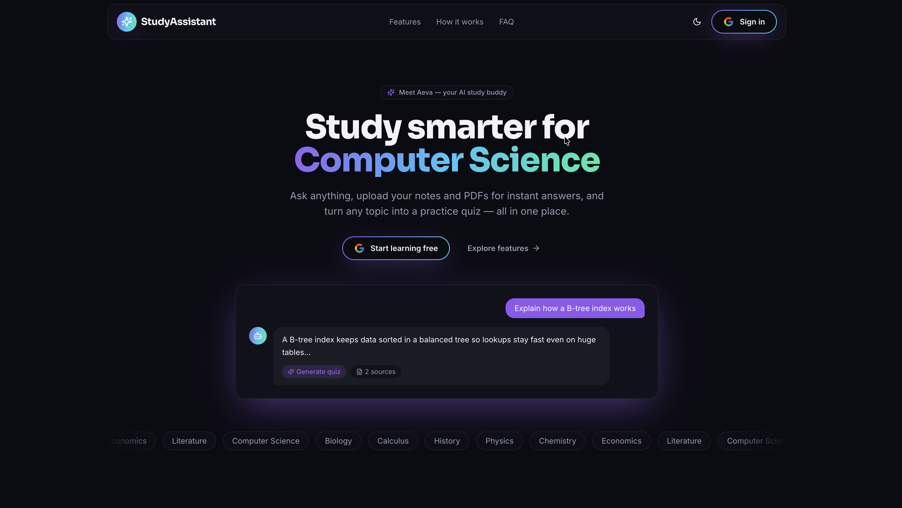
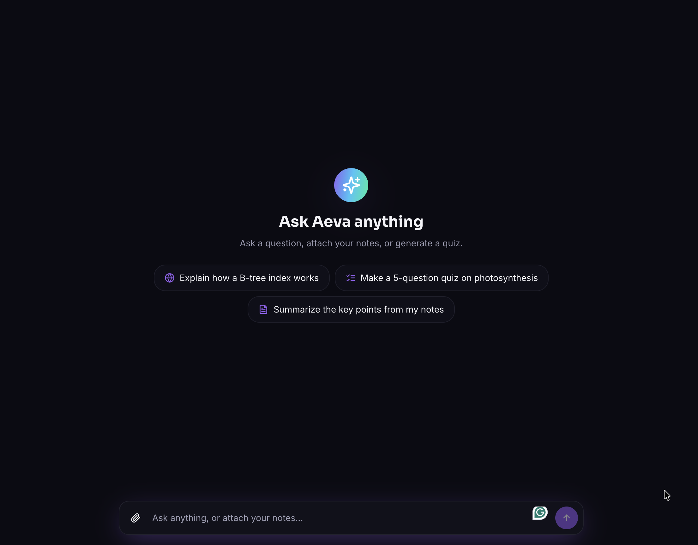

# StudyAssistant 📘 — meet **Aeva**, your AI study buddy

StudyAssistant is an AI study app for students. Ask any question, upload your notes and
PDFs for instant answers, and turn any topic into a practice quiz — all in one place.
The in-app assistant is named **Aeva**.

> **Product:** StudyAssistant · **Assistant:** Aeva

---

## ✨ Features

- **Ask anything** — web-search-grounded answers (Gemini + Google Search), streamed
  token-by-token.
- **Chat with your notes** — upload PDFs & images; Aeva reads them and answers from your
  own material (multimodal).
- **Practice quizzes** — generate a configurable quiz (count / difficulty / question types /
  source) that opens in a focused exam side‑panel, then get scored with AI feedback.
- **Smart clarifications** — when a request is ambiguous (e.g. multiple files selected and
  "summarize this"), Aeva asks which one instead of guessing.
- **Sessions & history** — every chat is saved and resumable; the active session lives in the
  URL (`/chat?sessionId=…`) so a refresh restores it.
- **Media library** — a right sidebar of all your uploads with per‑file upload progress and
  select‑as‑context.
- **Polished UX** — animated, SEO‑optimized landing page, Google sign‑in, light/dark themes,
  fully mobile‑responsive, skeleton loaders, smooth streaming.
- **Extensible AI core** — MCP‑style tool orchestration and a provider‑agnostic LLM layer
  (Gemini today; new providers drop in via config).

---

## 🖼️ Screenshots

> Add the images at `docs/landing.png` and `docs/chat.png` (see `docs/README.md`).

**Landing page**



**Chat experience**



---

## 🏗️ Architecture

```
┌──────────────────────────┐        HTTPS / SSE        ┌────────────────────────────┐
│  Frontend (Vite + React) │  ───────────────────────► │  Backend (Flask + smorest) │
│  Aurora‑glass UI, SPA     │  ◄─────────────────────── │  REST + /assistant/stream  │
└──────────────────────────┘   { msg, data } envelope  └─────────────┬──────────────┘
                                                                      │
                                       ┌──────────────────────────────┼───────────────────────┐
                                       ▼                              ▼                        ▼
                              Assistant Orchestrator         MCP Tool Registry          Supabase
                              (plan → clarify / run)   web_search · media_llm · quiz   Postgres · Storage · Auth
                                       │
                                       ▼
                              LLM provider layer  →  Google Gemini  (provider‑agnostic)
```

- The orchestrator plans each turn, optionally asks a clarifying question, then runs exactly
  one tool and streams the result.
- The LLM layer is behind a provider interface, so models/providers are configurable per
  capability (web search, media, quiz, orchestration).

---

## 🧰 Tech stack

| Layer | Tech |
|------|------|
| Frontend | Vite, React 18, TypeScript, Tailwind CSS, shadcn/ui (Radix), framer‑motion, TanStack Query, React Router, react‑helmet‑async |
| Backend | Python 3.12, Flask, flask‑smorest (OpenAPI/Swagger), marshmallow, dependency‑injector |
| AI | Google Gemini (`google-genai`), MCP‑style tools, Google Search grounding |
| Data | Supabase — Postgres, Storage, Auth (Google OAuth) |
| Deploy | Vercel (two projects) |

---

## 📂 Repository layout

```
.
├── frontend/        # Vite + React SPA      → see frontend/README.md
├── backend_v2/      # Flask API + AI core   → see backend_v2/README.md
├── docs/            # screenshots / assets
├── DEPLOYMENT.md    # Vercel deployment guide
└── README.md        # you are here
```

---

## 🚀 Quick start (local)

**Backend** (`backend_v2/`)
```bash
cd backend_v2
cp .env.sample .env          # fill in Supabase + Gemini keys
poetry install
poetry run poe run           # http://localhost:8000  (Swagger UI: /docs)
```

**Frontend** (`frontend/`)
```bash
cd frontend
cp env.example .env          # set VITE_API_BASE_URL=http://localhost:8000
npm install
npm run dev                  # http://localhost:8080
```

Full setup details: **[frontend/README.md](frontend/README.md)** ·
**[backend_v2/README.md](backend_v2/README.md)**. Deploying to Vercel:
**[DEPLOYMENT.md](DEPLOYMENT.md)**.
